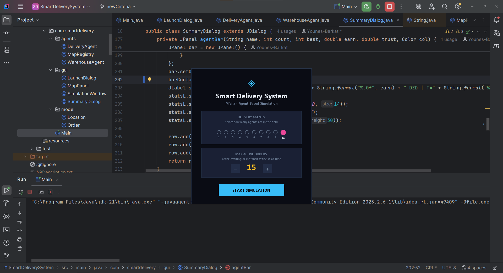
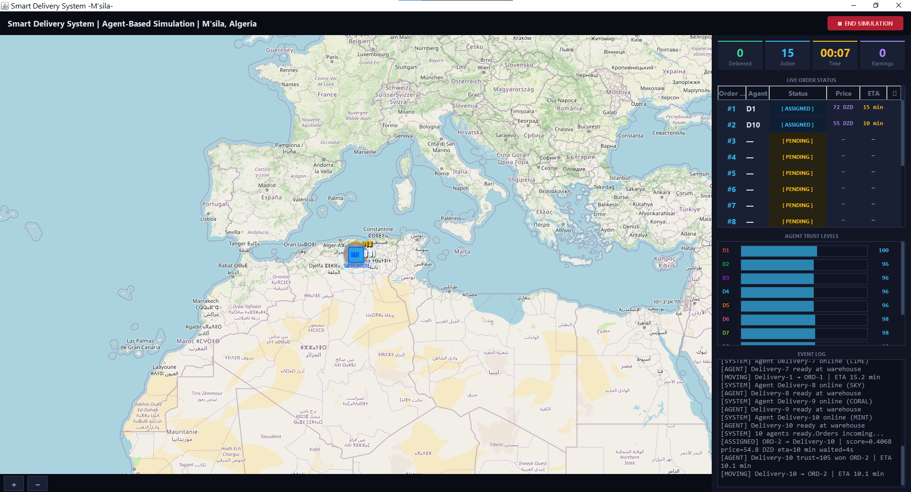
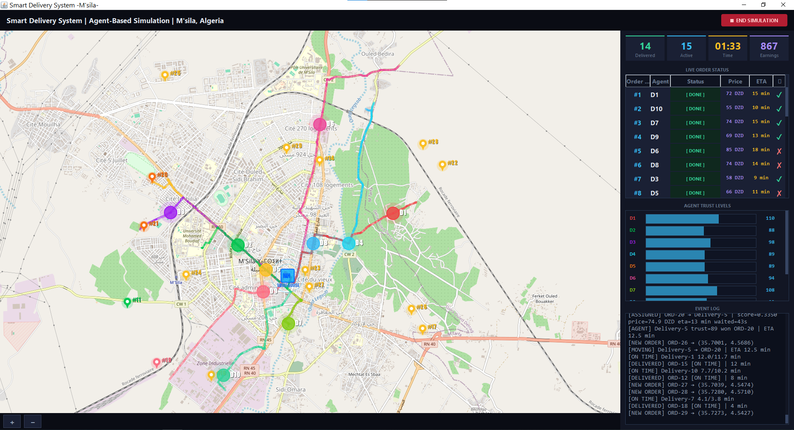
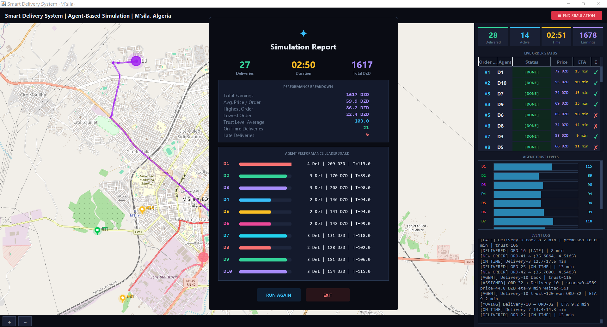

# 🚚 Smart Delivery System — Agent-Based Simulation

> A multi-agent delivery simulation built with **JADE** and **JXMapViewer2**, running on a live OpenStreetMap of **M'sila, Algeria**. Agents negotiate for orders, drive real roads, build trust over time, and compete in a scored bidding auction — all visualized on a dark-mode live dashboard.

---

## 📸 Screenshots

### 🔧 Launch Configuration

Pick your agent count (1–10) and how many orders should be active at once (1–15), then hit Start.



---

### 🗺️ Simulation Start — Map View

Agents appear on the real M'sila map, connect to the warehouse, and wait for their first orders to be dispatched.



---

### ⚡ Mid-Simulation — Agents in Action

Each agent follows a real OSRM road route shown as a colored line. Orders glow with the agent's color when picked up. The live dashboard shows ETA, price, and on-time status per order.



---

### 📊 End-of-Simulation Report

A polished analytics overlay shows total deliveries, duration in sim-minutes, earnings, on-time rate, and a full agent leaderboard with colored progress bars.



---

## 🧠 How It Works

Agents are fully autonomous — they register themselves, listen for job offers, calculate their own bids, drive their own routes, handle obstacles, and report back when done. The warehouse never tells anyone where to go. It just announces jobs and runs a scored auction.

The coordination mechanism is the **Contract Net Protocol (CNP)**:

```
Warehouse ──[ CFP ]──────────────► D1, D2, D3...
          ◄──[ PROPOSE: price/dist/trust ]── D2 (free, closer)
          ◄──[ PROPOSE: price/dist/trust ]── D1 (free, farther)
          ◄──[ REFUSE: BUSY  ]──────────── D3 (busy)
          ──[ ACCEPT ]──────────────────► D2  (lowest score wins)
          ──[ REJECT ]──────────────────► D1
          ◄──[ INFORM: DONE  ]──────────── D2 (after delivery)
```

Routes come from the free **OSRM** public API — real streets, real turns. If the API is unreachable, agents fall back to a straight-line interpolation and keep going without missing a beat.

---

## 🏆 The Bidding & Scoring System

Winning isn't just about being the cheapest. The warehouse scores every bid using a **weighted formula** across three factors:

```
Score = (0.30 × Price) + (0.50 × Distance) − (0.20 × Trust)
```

**🏅 The agent with the LOWEST score wins.**

| Factor      | Weight | Why                                        |
| ----------- | ------ | ------------------------------------------ |
| 📏 Distance | 50%    | Closest agent = fastest delivery           |
| 💰 Price    | 30%    | Cheaper is better for the customer         |
| ⭐ Trust    | 20%    | Subtracted — higher trust lowers the score |

### 📏 How Distance is Calculated

Each agent measures the **full journey**, not just warehouse to order:

```
Total Distance = agent.currentPosition → Warehouse  +  Warehouse → Order
```

This uses the **Haversine formula** on real GPS coordinates for accurate curved-earth distance.

---

## ⭐ Trust Level System

Agents build (or lose) reputation over time, which directly affects their bid price and scoring:

| Event           | Trust Change |
| --------------- | ------------ |
| 🏆 Win a bid    | +5           |
| ❌ Lose a bid   | −2           |
| ⏰ Deliver late | −5           |
| 🔒 Min / Max    | 10 / 150     |

Trust affects the **bid price** directly:

```
bidPrice = (baseFee + distance × ratePerKm) × (100 / trust_level)
```

An agent with trust=150 bids ~33% cheaper than a new agent (trust=100). Reliable agents earn more work. 📈

---

## 🎲 Obstacle Simulation

Each trip rolls a **single random obstacle** at route-fetch time (not per waypoint — that caused all agents to be late):

| Probability | Event          | Effect                                |
| ----------- | -------------- | ------------------------------------- |
| 10%         | 🚧 Road Block  | Agent pauses ~2 sim-minutes mid-route |
| 25%         | 🚦 Traffic Jam | 10 slow waypoints at 3× step delay    |
| 65%         | ✅ Clear Route | Arrives on time                       |

On-time check: `elapsedRealMs ≤ deadlineMs` where `deadlineMs = path.size() × 250ms × 1.15 grace margin`

---

## ⏱️ Simulation Time

Everything runs in **sim-minutes**, not real seconds:

```
DISPLAY_SCALE = 20.0
simMinutes = realMilliseconds × 20 / 60_000
```

So 1 real minute = 20 sim-minutes. ETAs, the dashboard timer, logs, and the summary report all use the same scale.

---

## ✨ Features

- 🤖 **1–10 delivery agents** — each gets a unique color across map dot, route line, pin, and leaderboard
- 📦 **1–15 concurrent orders** — warehouse fills slots automatically via background tickers
- 🗺️ **Live OpenStreetMap** of M'sila — draggable, zoomable, real tiles
- 🛣️ **Real road routing** via OSRM, with offline straight-line fallback
- 📍 **Color-coded delivery pins** — yellow while waiting, switches to agent color when assigned
- 🏆 **Multi-factor scored bidding** — price + distance + trust (not just "cheapest wins")
- 🎲 **Obstacle simulation** — road blocks and traffic jams create realistic ~25% late delivery rate
- ⭐ **Trust system** — agents build reputation over time, affecting future bid competitiveness
- 📊 **Dark-mode dashboard** — live order table (Order · Agent · Status · Price · ETA · ✓/✗), event log, stats
- ⏱️ **Sim-time display** — timer, ETAs, and logs all in sim-minutes (not raw seconds)
- 📈 **End-of-simulation report** — deliveries, duration, earnings, on-time %, agent leaderboard
- 🚀 **Launch dialog** — configure agents and order count before each run

---

## 🏗️ Project Structure

```
src/main/java/com/smartdelivery/
│
├── 📄 Main.java                     entry point — launches JADE + Swing
│
├── 🤖 agents/
│   ├── WarehouseAgent.java          order generation + Contract Net auctioneer
│   ├── DeliveryAgent.java           bids, drives, handles obstacles, builds trust
│   └── MapRegistry.java             thread-safe bridge between JADE and Swing
│
├── 🖥️ gui/
│   ├── LaunchDialog.java            pre-simulation config screen
│   ├── SimulationWindow.java        main window — map + dashboard + stats
│   ├── MapPanel.java                JXMapViewer2 + 4 custom painters
│   └── SummaryDialog.java           end-of-simulation analytics + leaderboard
│
└── 📦 model/
    ├── Order.java                   PENDING → ASSIGNED → EN ROUTE → DELIVERED
    └── Location.java                lat/lon + Haversine distance formula
```

---

## 🔧 How Agents Are Built

Each delivery agent runs three JADE behaviours in sequence:

| Behaviour    | Type                   | What It Does                                                                                       |
| ------------ | ---------------------- | -------------------------------------------------------------------------------------------------- |
| `WaitForJob` | `CyclicBehaviour`      | Listens forever for CFPs. Bids if free, refuses if busy. Only calls `block()` when genuinely idle. |
| `GoDeliver`  | `Behaviour` (one-shot) | Fetches OSRM route, walks waypoints at 250ms/step. Handles road block / traffic obstacle.          |
| `GoBack`     | `Behaviour` (one-shot) | Drives back to warehouse. Sets `free = true` on arrival.                                           |

The **warehouse** uses four JADE behaviours simultaneously:

| Behaviour                     | Type              | Interval                         |
| ----------------------------- | ----------------- | -------------------------------- |
| `ReceiveDeliveryConfirmation` | `CyclicBehaviour` | — listens for DELIVERED messages |
| `DispatchTicker`              | `TickerBehaviour` | every 2500ms                     |
| `FillTicker`                  | `TickerBehaviour` | every 1500ms                     |
| `StartupWaker`                | `WakerBehaviour`  | fires once after 3000ms          |

> ⚠️ **Critical design note:** `block()` is only called when `free == true && no messages`. Calling it unconditionally would freeze the JADE thread and stall `GoDeliver` — the agent would show "Routing..." forever and never move. This was the hardest bug to track down.

---

## 🎨 Agent Colors

10 agents, 10 colors — consistent across the map dot, route line, delivery pin, and summary leaderboard.

| Agent | Color       | Hex       |
| ----- | ----------- | --------- |
| D1    | 🔴 Red      | `#EF4444` |
| D2    | 🟢 Green    | `#00C850` |
| D3    | 🟠 Orange   | `#F97316` |
| D4    | 🩵 Cyan     | `#22D3EE` |
| D5    | 🟡 Yellow   | `#FBBf24` |
| D6    | 🩷 Pink     | `#EC4899` |
| D7    | 💚 Lime     | `#84CC16` |
| D8    | 🔵 Sky Blue | `#38BDF8` |
| D9    | 🪸 Coral    | `#FB7185` |
| D10   | 🌿 Mint     | `#34D399` |

---

## 🚀 Getting Started

You need **JDK 21+** and **Maven**. An internet connection is recommended for map tiles and OSRM routing but the simulation degrades gracefully offline.

```bash
git clone https://github.com/Younes-Barkat/Delivery-System-Simulation.git
cd Delivery-System-Simulation
mvn clean package
mvn exec:java -Dexec.mainClass="com.smartdelivery.Main"
```

A launch dialog appears first. Pick your agent count and order limit, then hit **START SIMULATION**. 🎯

### 📦 Maven Dependencies

```xml
<repositories>
  <repository>
    <id>jade-repo</id>
    <url>https://jade.tilab.com/maven/</url>
  </repository>
</repositories>

<dependencies>
  <dependency>
    <groupId>com.tilab.jade</groupId>
    <artifactId>jade</artifactId>
    <version>4.5.0</version>
  </dependency>
  <dependency>
    <groupId>org.jxmapviewer</groupId>
    <artifactId>jxmapviewer2</artifactId>
    <version>2.6</version>
  </dependency>
  <dependency>
    <groupId>org.slf4j</groupId>
    <artifactId>slf4j-simple</artifactId>
    <version>1.7.36</version>
  </dependency>
</dependencies>
```

---

## 🗺️ Map Controls

| Action       | How                                 |
| ------------ | ----------------------------------- |
| Pan          | Click and drag                      |
| Zoom in/out  | Mouse scroll wheel                  |
| Zoom buttons | `+` / `−` in the bottom-left corner |

---

## ⚙️ Tunable Parameters

Most simulation behavior is controlled by constants at the top of their files — easy to find and tweak.

| What                         | Default                          | Where                         |
| ---------------------------- | -------------------------------- | ----------------------------- |
| 🏎️ Agent speed               | `30 km/h`                        | `DeliveryAgent.SPEED`         |
| 👁️ Step delay (visual speed) | `250 ms`                         | `DeliveryAgent.STEP`          |
| 📏 Waypoints per km          | `35.0`                           | `DeliveryAgent.WP_PER_KM`     |
| ⏱️ Sim-time scale            | `20.0`                           | `DeliveryAgent.DISPLAY_SCALE` |
| 🚧 Road block chance         | `10%`                            | `DeliveryAgent.BLOCK_PROB`    |
| 🚦 Traffic jam chance        | `25%`                            | `DeliveryAgent.TRAFFIC_PROB`  |
| ⏳ Late margin grace         | `15%`                            | `DeliveryAgent.LATE_MARGIN`   |
| 📬 Dispatch interval         | `2500 ms`                        | `WarehouseAgent.TICK`         |
| 🔁 Order fill interval       | `1500 ms`                        | `WarehouseAgent`              |
| 🗺️ M'sila bounding box       | `35.685–35.740 N, 4.505–4.580 E` | `WarehouseAgent`              |
| ⚖️ Score weight — Distance   | `0.50`                           | `WarehouseAgent.W_DISTANCE`   |
| ⚖️ Score weight — Price      | `0.30`                           | `WarehouseAgent.W_PRICE`      |
| ⚖️ Score weight — Trust      | `0.20`                           | `WarehouseAgent.W_TRUST`      |

Max agents and max orders are set at runtime via the launch dialog.

---

## 🐛 Notable Bugs Fixed

A few non-obvious issues came up during development worth documenting for anyone extending this:

| Bug                                    | Root Cause                                                                                  | Fix                                                    |
| -------------------------------------- | ------------------------------------------------------------------------------------------- | ------------------------------------------------------ |
| 🪪 Duplicate order IDs                 | `currentTimeMillis() % 10000` collided when two orders spawned in the same ms               | Switched to a simple `int seq` counter                 |
| 📦 Agent taking two orders at once     | ACCEPT handler didn't check `free` before accepting                                         | Added `&& free` guard condition                        |
| 🧊 Agents frozen at "Routing..."       | `block()` called unconditionally, suspending the JADE thread                                | Made `block()` conditional on `free == true`           |
| 🖥️ GUI flickering / teleporting agents | JADE threads writing directly to Swing components                                           | Wrapped all repaints in `SwingUtilities.invokeLater()` |
| ⏰ All agents always late              | Obstacles rolled per-waypoint — expected 8+ sim-minutes of extra delay per trip             | Obstacles rolled **once per trip** at route-fetch time |
| 🕒 Timer out of sync with ETAs         | Dashboard timer counted real seconds, ETAs were in sim-minutes                              | Both now use `DISPLAY_SCALE = 20.0` conversion         |
| 💥 Summary crash                       | `ArrayIndexOutOfBoundsException` from calling `.values()` on maps with different key counts | All agent lists now built from a single keyset loop    |

---

## 🧰 Tech Stack

|                    |                        |
| ------------------ | ---------------------- |
| 🤖 Agent framework | JADE 4.5.0             |
| 🗺️ Map rendering   | JXMapViewer2 2.6       |
| 🌍 Map tiles       | OpenStreetMap          |
| 🛣️ Road routing    | OSRM (free public API) |
| 🖥️ GUI             | Java Swing             |
| ⚙️ Build           | Maven                  |
| ☕ Java            | JDK 21                 |

---

## 👨‍💻 Authors

## **Barkat Younes** — [@Younes-Barkat](https://github.com/Younes-Barkat)

## **Benkhelil Mohamed El Amin**

## **Attoui Radhwane**

**Melouki Anes CHoayb**

Under the supervision of **Dr. Meliouh Amel** — M'sila University, Department of Computer Science 🎓
For better understanding go and see the [Presentation](https://gamma.app/docs/Smart-Delivery-System-1ylop0s3k8j1rse)

---

## 📄 License

MIT
